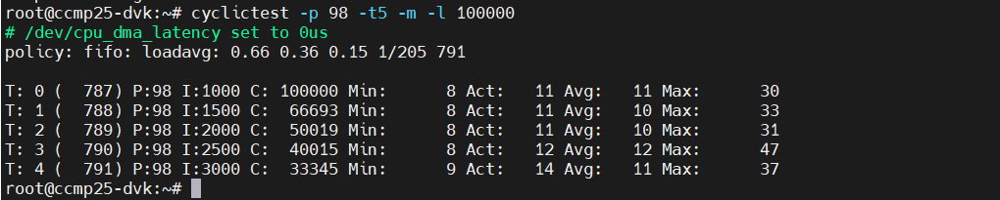

# ROS2镜像快速上手

:::
## 安装前的准备
同标准的deyaio一样，如果从没有安装过依赖包，请先安装，以下以Ubuntu 22.04为例：
```
sudo apt install gawk wget file git diffstat file unzip texinfo gcc build-essential chrpath socat cpio python3 python3-pip python3-pexpect xz-utils debianutils iputils-ping python3-git python3-jinja2 libegl1-mesa libsdl1.2-dev pylint xterm python3-subunit mesa-common-dev zstd liblz4-tool gfortran
sudo apt install python-is-python3
```
安装repo工具并配置git
```
sudo apt install repo
git config --global user.name yourname
git config --global user.email you@email.com
```

## 安装带ros支持的deyaio
建议以板卡名称来命名deyaio目录，比如deyaio-ccmp25dvk-ros或deyaio-ccmp25plc-ros，

比如Digi开发板
```
cd
mkdir deyaio-ccmp25dvk-ros
cd deyaio-ccmp25dvk-ros
repo init -u https://github.com/peyoot/dey-aio-manifest.git -b scarthgap -m ros.xml 
repo sync
```
或是ST ccmp25plc开发板
```
cd
mkdir deyaio-ccmp25plc-ros
cd deyaio-ccmp25dvk-ros
repo init -u https://github.com/peyoot/dey-aio-manifest.git -b scarthgap -m ros-ccmp25plc.xml 
repo sync
```

## 创建带ros支持的dey项目
cd dey5.0/workspace
mkdir ccmp25dvk
cd ccmp25dvk
source ../../mkproject.sh -p ccmp25-dvk

## 编译并生成镜像
编辑conf/local.conf 并添加您所需的软件包，以下仅供参考:
对于不带屏的设备实时设备，建议
```
DISTRO_FEATURES:append = " rt opengl pam "
DISTRO_FEATURES:remove = " weston x11 cellular 3g "
DISTRO_FEATURES:remove = " bluetooth wifi "

IMAGE_INSTALL:append = " \
    ros-core \
    packagegroup-ros2-demos \
    screen \
"

PACKAGECONFIG:remove:pn-networkmanager = " modemmanager"
PACKAGECONFIG:remove:pn-networkmanager = " ppp"

RDEPENDS:packagegroup-dey-core:remove = " connectcore-demo-example xbee-init"
RDEPENDS:packagegroup-dey-network:remove = " ppp modemmanager gstreamer "
RDEPENDS:networkmanager:remove = " ppp modemmanager "
RDEPENDS:packagegroup-machine-base:remove = " xbee-init"

# 禁用 swupdate 服务的自动启动（同时会禁用其 socket，因为它们属于同一配方）
SYSTEMD_AUTO_ENABLE:pn-swupdate = "disable"

IMAGE_INSTALL:remove = " mtdev vsftpd lighttpd avahi-daemon hostapd \
                         pulseaudio \
                         ppp modemmanager \
                       "

IMAGE_INSTALL:remove = " wayland wayland-protocols libxkbcommon libinput libevdev \
                         swupdate swupdate-www \
                         ssh-server-openssh \
                       "

SKIP_RECIPE[modemmanager] = "Not needed, no cellular module"
SKIP_RECIPE[ppp] = "Not needed, no cellular module"
SKIP_RECIPE[xbee] = "Not needed, no xbee module"
#SKIP_RECIPE[swupdate] = "Diagnosing dependency"

# 移除调试特性
IMAGE_FEATURES:remove = " eclipse-debug dbg-pkgs tools-debug tools-profile tools-testapps dev-pkgs package-management"

# 全局抑制调试符号
INHIBIT_PACKAGE_DEBUG_SPLIT = "1"
```
带屏的设备，可以编译镜像dey-image-qtros
```
GLIBC_GENERATE_LOCALES = "zh_CN.UTF-8 en_GB.UTF-8 en_US.UTF-8"
IMAGE_LINGUAS = "zh-cn"
LOCALE_UTF8_ONLY="1"

IMAGE_INSTALL:append = " qt5-demo-extrafiles cinematicexperience-rhi cinematicexperience-rhi-tools turtlesim glibc-utils localedef tmux homeaddons"

```
现在可以编译带ros支持的镜像了
```
bitbake core-image-base
或
bitbake dey-image-qtros
```

## 发布并打包
早期DEY没有提供打包功能，因此deyaio项目用脚本实现打包，在DEY 5.0时，编译项目已经可以自动打包了，两者生成的固件名称略有不同，因此安装时设置image-name时要因应设置。

DEY-AIO的脚本打包，方法如下：

```
cd ../..
./publish
```
按照提示操作并选择正确的项目。
对于镜像类型，您仍然需要选择 dey-imag-qt，因为 ros 镜像 （dey-image-qtros） 是基于 qt 镜像的。
当提示询问它是否是 ROS 项目时，输入“yes”。

您可以选择将编译后的输出拷贝到发布文件夹并将其打包成卡刷包或发布到 TFTP/NFS 路径或服务器上。

而官方默认的打包生成的是：
```
dey-image-qt-wayland-humble-ccmp25-dvk.boot.vfat
dey-image-qt-wayland-humble-ccmp25-dvk.ext4
dey-image-qt-wayland-humble-ccmp25-dvk.recovery.vfat
```
因此运行卡刷时的image-name应设置成dey-image-qt-wayland-humble 或 core-image-base-humble

如果注重实时性，应关闭WiFi，使用不带WiFi的型号效果最好，带Wifi的型号如果仅在uboot中禁掉WiFi，也有一定效果。
其实，带wifi型号未禁用Wifi时的实测数据：


## 测试ros2功能
为了测试ros功能，带有screen或tmux的固件会比较方便，以便打开更多终端session.
进入linux后，先source一下ros2的环境变量：
```
source /opt/ros/humble/setup.bash
# 1. 检查 ROS 环境变量
echo $ROS_DISTRO
echo $ROS_VERSION

#2 检查 ROS 核心包是否安装
ros2 pkg list | grep -E "rclcpp|std_msgs|demo|ros_core"

#3 运行基础测试（ROS 2 推荐）
#3.1 启动 ROS 2 daemon（后台）
ros2 daemon start

#3.2 检查是否正常
ros2 daemon status

#3.3 测试 talker + listener（最经典的测试）
用screen或tmux新建Session, 以screen为例
screen -S ros_test
# screen终端 ros_test：
ros2 run demo_nodes_cpp talker

#3.4 按ctrl+a d 回原终端 ：
ros2 run demo_nodes_cpp listener

你应该能看到 talker 持续发布消息，listener 接收到消息。

#3.5 其它快速测试
ros2 node list
ros2 topic list
ros2 topic echo /chatter     # 如果有 talker 在跑
```

## recovery
如果刷错固件，变砖，仍有办法恢复固件，一般最简单的就是用USBC来恢复，参考Digi官方的recover your device这一章节。
您需要一台Linux机器，比如Ubuntu 24.04，先安装好dfu-tool

```
sudo apt install dfu-util
```
恢复变砖的设备，需要更改启动选项为USB启动，拨盘开关的2为on，其余三个是off。

将刷机固件包解压到一台Ubuntu的机器上，注意不同版本可能不同，检查是否包括fip-ccmp25-dvk-ddr-optee-emmc.bin，如果缺失可以手动从编译目录拷过来。
写个刷机脚本：
```
#!/bin/bash
dfu-util -a 0 -D tf-a-ccmp25-dvk-optee-usb.stm32
dfu-util -a 0 -e
sleep 1
dfu-util -a 0 -D fip-ccmp25-dvk-ddr-optee-emmc.bin
dfu-util -a 0 -e
sleep 1
dfu-util -a 1 -D fip-ccmp25-dvk-optee-emmc.bin
dfu-util -a 0 -e
```
你需要两条type C的线缆，一条是接console到调试主机，另一台是接USBC到提供dfu-util刷机工具和固件的Ubuntu机器上，当然如果你使用同一台电脑，用两个终端也行。但一般你可以用windows作为调试主机查看终端输出。
运行脚本，最后一个指令加载uboot到内存后，就可以重新向模块内的闪存烧写正确的固件。

注意，上面脚本启动时，你需要不停地在终端按任意键，以便停在uboot里,以任意方式刷固件。如果没有停在uboot中，则是默认进入uuu刷固件。
不过既然已经用了USBC来恢复固件，用UUU的方式刷固件也是最容易的。如果只是刷uboot，可以用最简单的方式写个脚本
```
#!/bin/bash
uuu FB: flash boot1 tf-a-ccmp25-dvk-optee-emmc.stm32
sleep 10
uuu FB: flash boot2 tf-a-ccmp25-dvk-optee-emmc.stm32
sleep 10
uuu FB: flash metadata1 metadata-ccmp25-dvk.bin
sleep 10
uuu FB: flash metadata2 metadata-ccmp25-dvk.bin
sleep 10
uuu FB: flash fip-a fip-ccmp25-dvk-optee-emmc.bin
sleep 10
uuu FB: flash fip-b fip-ccmp25-dvk-optee-emmc.bin
```
刷好后，模块的内置flash已经恢复了uboot固件，记得把拨盘开关拨回原来位置，以便从模块内置的闪存启动
上面的方法适用于仅更新Uboot，如果您需要把系统固件也用uuu刷入，可以用Digi的install_linux_fw_uuu.sh脚本，注意其它intall开头的脚本是适用于在目标板上执行刷机，而适用于uuu这个脚本是在Ubuntu主机上执行的，只不过，你可以更改一下默认的镜像名称，特别是恢复固件后，默认image-name没设置，为了定义image-name，除了在uboot内设置外，也可以在这个install_linux_fw_uuu.sh里直接改，在130行左右的IMAGE_NAME里定义，比如
```
IMAGE_NAME="core-image-base-humble"
```
不过上面uuu刷机脚本主要针对dvk，其它的板卡建议直接用卡刷的方式来恢复固件


## 调试
首次编译时没有镜像生成，先检查镜像配方，其中有：
```
inherit ros_distro_${ROS_DISTRO}
inherit ${ROS_DISTRO_TYPE}_image
```
检查变量值
```
robin@nuc8vm1:~/deyaio-ros/dey5.0/workspace/ccmp25-ros$ bitbake-getvar -r dey-image-qtros ROS_DISTRO                                                                                                           
#                                                                                                                                                                                                              
# $ROS_DISTRO [2 operations]                                                                                                                                                                                   
#   set /home/robin/deyaio-ros/dey5.0/sources/meta-ros/meta-ros-common/conf/ros-distro/ros-distro.conf:43                                                                                                      
#     [_defaultval] "${@d.getVar('ROS2_DISTRO') if d.getVar('ROS2_DISTRO') not in (None, '') else d.getVar('ROS1_DISTRO')}"                                                                                    
#   set /home/robin/deyaio-ros/dey5.0/sources/meta-ros/meta-ros2-humble/classes/ros_distro_humble.bbclass:5                                                                                                    
#     "humble"                                                                                                                                                                                                 
# pre-expansion value:                                                                                                                                                                                         
#   "humble"                                                                                                                                                                                                   
ROS_DISTRO="humble"                                                                                                                                                            
robin@nuc8vm1:~/deyaio-ros/dey5.0/workspace/ccmp25-ros$ bitbake -e dey-image-qtros | grep -A 20 -B 5 "ROS_DISTRO"     
```
上面两个命令第一个是yocto新的功能，而另一个是传统方式，其中
```
-r dey-image-qtros：指定针对这个 recipe 的上下文（很重要，因为变量可能在不同 recipe 中有不同 override）。
如果只想看最终值（不看历史），可以加 --value：Bashbitbake-getvar -r dey-image-qtros --value ROS_DISTRO
```
