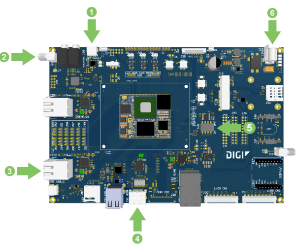
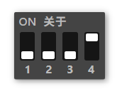
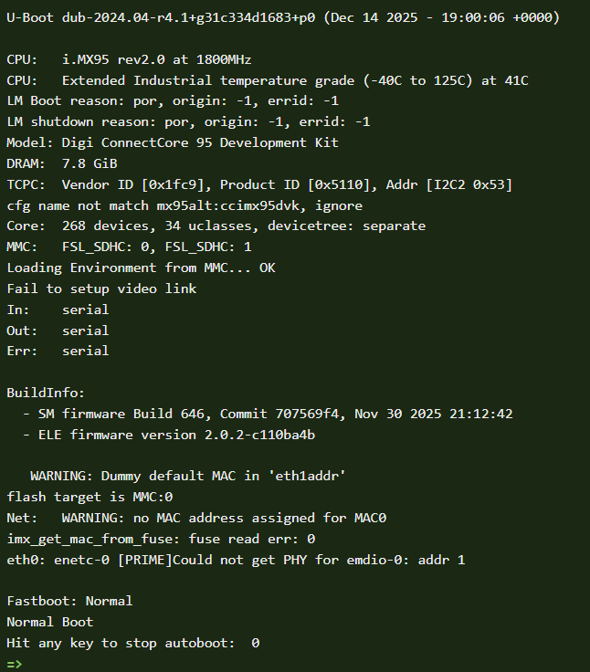

本文为ConnetCore 95的早期开发套件的上手指南，官方文档见：
https://docs.digi.com/resources/documentation/digidocs/embedded/dey/5.0/cc95/yocto-gs_index.html

本文档为删减版，如需更详细的内容，请访问上述官方文档

ConnectCore 95开发套件为ConnectCore95核心板的功能开发验证板。ConnectCore 95是基于i.MX95的工业级核心模组，除了硬件上集成了LPDDR5,eMMC，电源管理和Wifi6E等功能外，还额外附送Digi特有的强大的安全功能和免费云服务平台。开发套件上一般会有Digi云连接的二维码卡片。开发板可以用Digi ConnectCore APP激活免费的云服务支持。

作为入门快速上手指南，本篇章将带领你从开发套件开箱开始，手动更新一个固件并运行它自带的云服务演示程序，帮你熟悉和掌握Digi ConnectCore 95提供的基本功能和服务。

  #### 一、开箱
请确认您的 ConnectCore 95 开发套件包含以下组件：
  * ConnectCore 95 开发板
  * 12V 电源
  * USB Type C电缆
  * WiFi天线

您需要一台Linux机器作为系统固件和应用程序开发的电脑主机，建议使用Ubuntu 22.04LTS，至少4GB以上内存和300G以上硬盘空间。

  #### 二、硬件连接和设置
Windows下可以用mobaXterm等串口终端工具刷固件或查看console输出，系统一般可识别并自动安装usb转串口驱动程序。系统固件和应用程序开发一般需要用Linux机器。Linux下则需要手动安装USB转串口芯片的驱动，以便主机能识别开发板的console接口。
下载[USB 转串口驱动](https://github.com/digi-embedded/meta-digi/tree/scarthgap/scripts/install_usb_driver.sh)的脚本，然后运行：
```
chmod +x install_usb_driver.sh
sudo ./install_usb_driver.sh

Installing Cypress USB driver.
Rule "/etc/udev/rules.d/90-cyusb.rules" doesn't exist, creating a new one.
File "/etc/modprobe.d/blacklist.conf" exists, checking if the rule is already there.
Rule for cytherm not found. Adding cytherm to the blacklist.
Please plug/unplug your usb device to be recognized.
```
硬件连接示意图如下：

 1. 把 USB Type-C 线连接到主板上的 USB CONSOLE 接口，如果还没做的话，连接到你的主机电脑。
 2. 将 Wi-Fi 天线连接到 SMA 天线连接器。
 3. 把以太网线连接到以太网口。
 4. 可选：将一根未附带的 HDMI 线连接到 HDMI 接口，再连接到兼容 HDMI 的显示器。
 5. 确保启动微动开关（SW3）设置为从 eMMC 启动：

 6. 将 12V/4A 电源连接到电源桶连接器。

  #### 三、系统固件下载和升级

Digi的ConnectCore模块出厂即带有U-Boot，用户可以刷自己的固件或是官方的固件，含多种GUI框架支持。

ConnectCore 95目前是处于Beta阶段，您可以从Digi的[官方固件库](https://ftp1.digi.com/support/digiembeddedyocto/5.0/r3/images/ccimx95-dvk/)下载CC95的不同镜像刷机安装包。

请准备好一张格式化为FAT32的uSD卡或U盘，并提前下载要刷入的固件，并解压到SD卡或U盘上。开发板的接口示意图如下，Digi CC95开发板上的Console接口是通过USB转UART芯片暴露到开发板上的Type C接口（位于音频接口边上），你至少需要通过一根USB数据线将电脑的USB接口连接上Console口。建议按图示的顺序连接，其中，第5步可以选择使用的介质，比如使用U盘，则是将带有固件的U盘插入到USB Host接口上，使用UUU工具来刷固件时，则需连接开发板的USB OTG接口。

  ##### 更新固件
有四种方法更新固件，可以用SD卡，U盘或是uuu，以及网络实现固件更新。首先，将固件解压到介质中，在终端程序上设置串口的波特率为115200/8/n/1/n，然后上电，可以启动时按任意键停留在Uboot中，从便执行Uboot命令。

一、使用uSD/TF卡或U盘进行卡刷升级固件
注意32G以上的大容量的SD卡或U盘在windows下默认是格式化exFAT格式，而嵌入式领域通常需要格式化为FAT32。请使用正确的工具格式化好安装介质，然后将安装包解压到根目录中，并插入到开发板的相应接口上，上电开机，按任意键停留在UBoot中：

可以使用默认的刷机包，直接执行卡刷或usb刷机命令，或是在uboot中先设置一下image-name指定所刷的镜像包名称：
```
setenv image-name <镜像包名>  #仅刷非默认的镜像时需要，比如setenv image-name core-image-qt, 
```
ConnectCore 95默认刷机镜像名称为dey-image-chromium，如果您下载的是这个默认的镜像包，不需要上面设置，可以直接刷机：
  * 使用SD卡刷机时，所用命令：
```
run install_linux_fw_sd
```
或者，使用u盘时
```
run install_linux_fw_usb
```
刷机时请保持电源连接，并耐心等到刷机结束，通常一分钟内就能刷好，自动重启并进入系统。

  #### 四、使用手机APP例程配置您的设备
ConnectCore 95的默认刷机包dey-image-chromium集成有一个Digi云服务的例程，可以通过Web或App本地或远程配置你的设备。你需要创建一个 ConnectCore 云服务账户并添加你的设备。请通过Google Play或IOS商店查找安装： Digi ConnectCore Quick Setup应用。（国内安卓手机无法访问Google商店时，请向渠道商索取apk安装包）

1、在智能手机上启动 Digi ConnectCore 快速设置应用。

2、从主菜单选择 “Get Started”。
{.w-300 .rounded}

3、扫描你 ConnectCore 95 SOM 贴纸/标签上的二维码。该应用通过蓝牙连接到你的设备。

4、配置你的 ConnectCore 95 开发套件使其具备互联网访问权限。
选择你想配置的网络接口，填写设置，然后点击继续 。应用程序通过蓝牙发送网络参数值。

5、点击创建新账户以创建 ConnectCore 云服务账户。填写必填项，点击创建账户 。

6、当提示确认您接收激活令牌的电话号码时，点击 “是 ”。

7、您将收到一条短信，内含激活 ConnectCore 云服务账户的代码。如果没有自动完成，就在应用中输入代码。

8、您的账户已成功创建，设备自动注册。

  #### 五、远程管理您的设备
你可以通过本地显示界面（HDMI,LVDS）或是在浏览器输入开发板IP地址访问设备例程，也可以通过Digi的云服务API，即通过 Digi Remote Manager API 远程监控和管理设备。有关远程监控相关示例，请参考[官方文档：](https://docs.digi.com/resources/documentation/digidocs/embedded/dey/5.0/cc95/yocto-gs-manage-device-remotely_t.html)

  #### 继续开发和测试

现在你已经设置好了 ConnectCore 95，也可以测试其他[预编译镜像](https://docs.digi.com/resources/documentation/digidocs/embedded/dey/5.0/cc95/yocto-prebuilt-images_t.html)。

请从以下部分选择，或使用官方在线文档左侧导航栏，查找您使用 ConnectCore 95 所需的信息：

  - [开发应用程序](https://docs.digi.com/resources/documentation/digidocs/embedded/dey/5.0/cc95/develop-applications_c.html) ：为不同的支持的图形后端创建应用程序，并进行传输和调试。
  - [定制系统](https://docs.digi.com/resources/documentation/digidocs/embedded/dey/5.0/cc95/customize-system_c.html) ：根据您的需求定制固件，包括安装 Digi Embedded Yocto、创建和构建项目、配置和定制 Linux 内核及设备树，以及构建软件更新包。关于系统定制，您也可以使用[deyaio](https://peyoot.github.io/zh/deyaio/get-started.html)这个基于中国区定制工具（仍是以官方开发为基础，叠加了meta-custom支持）。
  - [部署](https://docs.digi.com/resources/documentation/digidocs/embedded/dey/5.0/cc95/deploy_c.html) ：将固件部署到设备存储介质，了解 eMMC 的分区布局及修改方法，然后转移和安装新固件。
  - [安全](https://docs.digi.com/resources/documentation/digidocs/embedded/dey/5.0/cc95/secure_c.html) ：学习使用 Digi TrustFence® 和 Digi ConnectCore 安全服务来保护您的设备。
  - [管理](https://docs.digi.com/resources/documentation/digidocs/embedded/dey/5.0/cc95/manage_c.html) ：监控和管理您的设备，包括使用 ConnectCore 云服务远程监控、管理和安全更新设备群。
  - [设计您的硬件](https://docs.digi.com/resources/documentation/digidocs/embedded/dey/5.0/cc95/design-your-hardware_c.html) ：为 ConnectCore 95 系统模块设计定制的承载板。