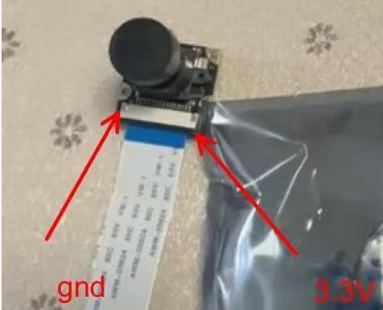

# CCMP25与摄像头接口
## 使用Connectcore MP25开发套件或自己开发的板卡测试
不论是开发板，或是自己做的板卡，默认只有U-Boot，为了测试不同的功能，需刷入不同的预编译镜像。

针对无线摄像头功能开发的镜像名是dey-image-lvgl，因此如果从Digi下载或获取到该固件，首先要把固件刷入到核心板。2
先将U盘或SD卡格式化为FAT32格式，将获取的镜像解压到根目录下，插入U盘或SD卡，上电后按任意键停留在uboot下,执行：
```
setenv image-name dey-image-lvgl
run install_linux_fw_sd  或者如果是用U盘 run install_linux_fw_usb
```
脚本会自动把系统镜像刷入到核心板的flash当中，并自动重启进入系统。


一般通过上电时加载不同的设备树，以实现对不同板卡的支持。在U-Boot中，有个变量fdt_file定义了上电时默认加载的设备树。如果刷入官方下载的预编译镜像，则默认地这个变量fdt_file=ccmp25-dvk.dtb。在UBoot下，可以通过
```
printenv fdt_file
```
来查看变量fdt_file的值，如果使用针对自己板卡编译的镜像而要在开发套件上测试，则fdt_file可能默认已经用了该板卡的设备树，则可以用下面命令改回来：
```
setenv fdt_file ccmp25-dvk.dtb
saveenv
```

## CCMP25 MIPI摄像头接口
MPU有一个MIPI接口，在Digi的开发板上，它接着15针SFW15S-2STE1LF插座和22针54548-2271插座。

从开发套件实际接口来看，让MIPI接口在上，HDMI接口在下，这样右上方第1脚为原理图中的Pin1，接地。黑色较厚的那面为金手指面方向。

而淘宝购得的摄像头，镜头朝上，接口朝下时，左边为GND，右边为3.3V。


可用金手指在同侧的15pin扁平线连接。（注意原来附送的扁平线不可以直接，勿毕要再买根同侧的15pin扁平线）


另外，需要注意的是，这MIPI上的通信是用I2C1。

注意，ov5640已经作为overlay来加载，在U-Boot下执行
```
setenv overlays ccmp25-dvk_ov5640-mipi-csi.dtbo,${overlays}
saveenv
reset
```

在Linux下测试OV5640，可参考官方文档：
https://docs.digi.com/resources/documentation/digidocs/embedded/dey/5.0/ccmp25/bsp-camera_r_ccmp25.html

尽管文档中部分内容是以imx335摄像头为例，但加载ov5640设备树overlay后，系统驱动已经支持ov5640，相关的命令行工具同样可以用在OV5640上。

## OV2740支持
刷入带有OV2740支持的固件，相关的驱动程序已经默认支持，可以仿照OV5640相关操作。

## 增加ST VD16GZ摄像头模组的支持

1. 首先检查驱动是否默认已经在源码树
默认的linux源码树中只有st-vgxy61.c，一款全局快门图像传感器，分辨率是 0.5 兆像素。所以VD16Gz彩色全局快门图像传感器，分辨率是 1.5 兆像素。两个驱动应该是不同。应些需要拉取正确的驱动到linux源码树下编译。未完待续...


#### 内网参考资料链接：

https://onedigi.atlassian.net/wiki/spaces/~gruiz/pages/234588897304/Video

#### 其它资料

https://wiki.st.com/stm32mpu/index.php?title=STM32MP2_V4L2_camera_overview&sfr=stm32mpu

https://test-videos.co.uk/
