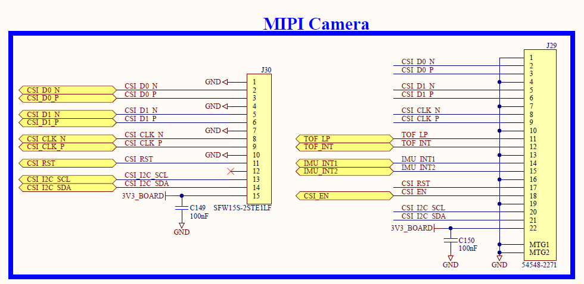

# CCMP25 MIPI摄像头接口
MPU有一个MIPI接口，在Digi的开发板上，它接着15针SFW15S-2STE1LF插座和22针54548-2271插座。

从开发套件实际接口来看，让MIPI接口在上，HDMI接口在下，这样右上方第1脚为原理图中的Pin1，接地。黑色较厚的那面为金手指面方向。

而淘宝购得的摄像头，镜头朝上，接口朝下时，左边为GND，右边为3.3V。
可用金手指在同侧的15pin扁平线连接。

另外，需要注意的是，这MIPI上的通信是用I2C1。

注意，ov5640已经作为overlay来加载，在U-Boot下执行
```
setenv overlays ccmp25-dvk_ov5640-mipi-csi.dtbo,${overlays}
saveenv
reset
```

## 增加ST VD16GZ摄像头模组的支持

1. 首先检查驱动是否默认已经在源码树吧
当前源码树中只有st-vgxy61.c，一款全局快门图像传感器，分辨率是 0.5 兆像素。所以VD16Gz彩色全局快门图像传感器，分辨率是 1.5 兆像素。两个驱动应该是不同。