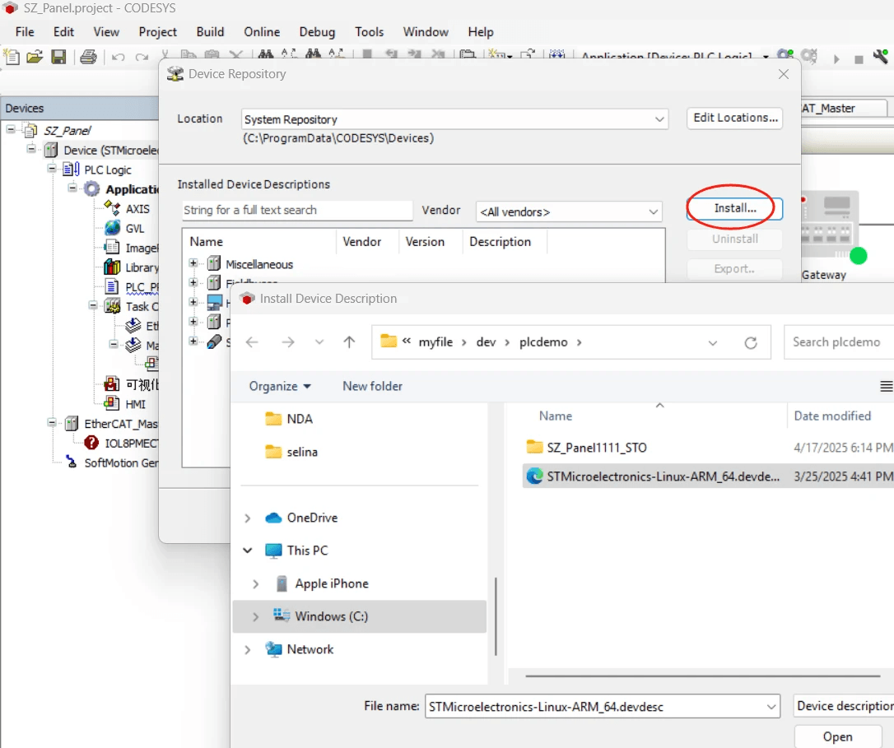
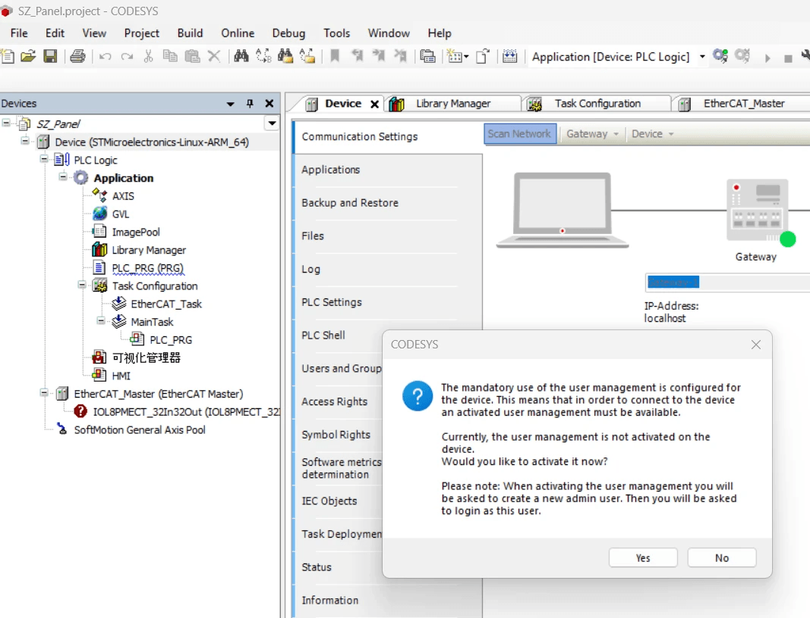
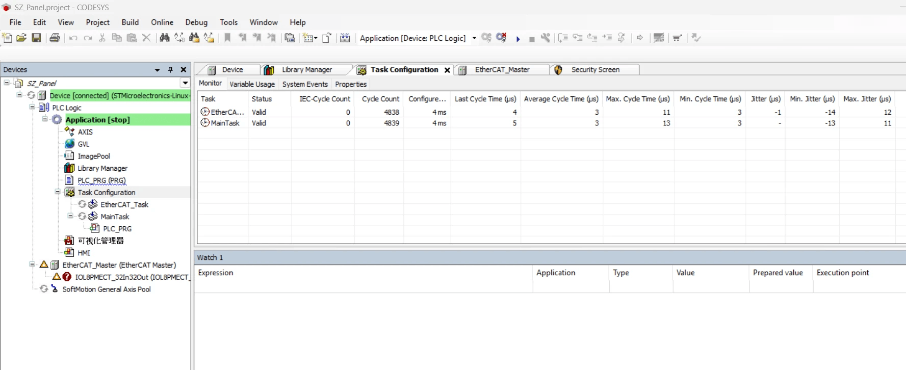

# ConnectCore MP25系列PLC参考设计

这是一款由ST设计，采用STM32MP255/257处理器，基于Digi ConnectCore MP25核心板的PLC参考设计板。可从下面链接下载完整的嘉立创工程文件，根据自己需要进行二次开发。
[下载原理图和设计文件，预编译镜像](https://git.eccee.com/Digi/ccmp25plc.git)

本板卡旨在验证Codesys支持和实时性，如需更多接口支持：如摄像头，LVDS显示等，可参考Digi官方的ConnecTCore MP25开发板，同样有完整的原理图工程文件提供参考（Altium Design）。
[Digi CCMP25官方文档入口](https://hub.digi.com/support/products/system-on-modules/digi-connectcore-mp25/)

用户也可使用Digi Smart IOmux软件，快速设计出符合自己需求的自定义接口的板卡，相关设备树驱动可直接由软件生成。

## ConnectCore MP25 PLC开发板快速上手
CCMP25 PLC开发板板的硬件版本，最新的是：EVLPLCMP257DGV1 ,HW REV 1.2 ;
供电电压为24V ;
接口资源，除了查看原理图外，也可以用SmartIOMux软件打开设计文件来查看。

板上的调试口即Console口，设计成USB转UART，用户只需用USB TYPE C数据线缆连接到电脑，通过115200/8/n/1波特率的终端来交互。


默认地，Digi Connectcore核心板出厂就带有U-Boot，用户可以刷入ccmp25plc预编译固件镜像，上电进入Linux环境执行相关测试。部分测试过的PLC板已经刷好预编译镜像。启动后直接到Linux登录界面，输入root直接回车便可进入系统。

上电后，对于刷有CodeSys例程的镜像，有一个自动运行的服务codesysstart.service ，它启动了/usr/local/codesyscontrol这个CodeSys例程。如果不需要运行CodeSys或是要运行自己的程序，应先停止该服务：

```
systemctl stop codesysstart
```

### 设备树文件和Overlay

ConnectCore MP25 PLC开发板使用的设备树版本位于：https://github.com/peyoot/ccmp25_dt/commits/ccmp25plc/

### BSP文档
可以参考[官方开发板的BSP文档](https://docs.digi.com/resources/documentation/digidocs/embedded/dey/5.0/ccmp25/bsp_index.html)，请结合smartIOmux设计文件或原理图，注意官方开发板和PLC开发板的硬件区别。

## 应用程序开发
您可使用官方的SDK，来开发应用程序，参考[官方文档](https://docs.digi.com/resources/documentation/digidocs/embedded/dey/5.0/ccmp25/develop-applications_c.html)

一般使用相同的DEY版本的SDK，可登陆后查询：
```
cat /etc/buildinfo
```

## 系统固件开发定制
参考[DEY-AIO文档](https://peyoot.github.io/zh/deyaio/get-started.html)

在DEY AIO开发环境中，用repo管理所使用的layer,安装好DEY AIO开发环境后，检出ccmp25plc所使用的repo代码库

```
cd
mkdir deyaio-ccmp25plc   
cd deyaio-ccmp25plc
repo init -u https://github.com/peyoot/dey-aio-manifest.git -b scarthgap -m ccmp25plc.xml   
repo sync
```
重新开一个终端，或是tmux一个终端，然后
```
cd ~/deyaio-ccmp25plc/dey5.0/workspace
mkdir ccmp25plc
cd ccmp25plc
source ../../mkproject.sh -p ccmp25-dvk
按空格到最后，输入“y"接受协议，然后就可以编译镜像y
bitbake core-image-base

```

# ConnnectCore MP25 PLC Codesys例程上手指南

要运行演示程序，开发电脑主机需要安装CODESYS Development System，演示例程是基于CODESYS 64 3.5.20.20 版本。

解压SZ_Panel1111_STO.rar，打开项目，点击“scan network”，出现一些Warning，可通过“Tools/Device Repository…”来安装必要的库：STMicroelectronics-Linux-ARM_64.devdesc 。



重新“scan network”，跳出：



点击“yes"，创建用户名“STACC”，并使用密码“123”。

然后用上面用户名和密码登陆，点击： “Task Configuration”，查看实时性。主要指标是EtherCAT_task的实时性。




