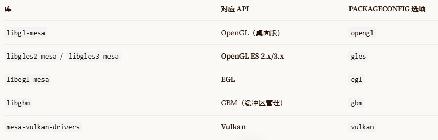

# DEY中的多媒体实现

GPU和VPU这些硬件IP核，一般同时支持OpenGL ES、Vulkan、OpenCL、OpenVX 等多套驱动入口。你的应用程序（包括 Qt）选哪套 API 去跟 GPU 对话，硬件都会被调度起来做加速。

一般在QT5下模式下，会启用 gles2 + egl，通过 EGLFS 调用 GPU，因此不需要用Vulkan，而Qt6 的 RHI 在嵌入式 Linux 上默认会按"Vulkan → OpenGL ES → software"的顺序探测可用后端。移除 Vulkan 后，RHI 会自动回退到 OpenGL ES。因此Vukan是可以移除的。

## Vulkan
Vulkan是一套由 Khronos Group 制定的开放、免版税的图形与计算 API 规范。作为是新一代跨平台 GPU API，为 PC、移动设备和嵌入式平台上的现代 GPU 提供高效访问。相比传统的 OpenGL ES，它的核心特点是：
低开销：更薄的驱动层，API 调用和状态切换的延迟显著低于 OpenGL ES。
  * 显式控制：开发者直接管理内存、同步和资源分配，而不是交给驱动"黑盒"处理
  * 原生多线程：多核 CPU 可以并行往 GPU 提交命令，图形管线始终吃饱
  * 跨平台跨厂商：同一套 API 可面向不同 GPU 厂商的硬件
在嵌入式场景里，Vulkan 跑在一个 Loader（加载器）+ ICD（可安装客户端驱动）​ 的架构上：
```
应用程序 → libvulkan.so (Loader) → 厂商 ICD 驱动 → GPU 固件
```

## mesa

Mesa 到底是什么包
在 Yocto 的 meta/recipes-graphics/mesa/ 里，mesa 是一个开源图形 API 实现集合，它通过 PACKAGECONFIG 提供多个独立的库 ：


也就是说，Mesa 不是单一包，而是一组图形库的集合。Vulkan 只是 Mesa 提供的诸多库之一。
一般而言，厂商驱动替代了 Mesa 的角色​。STM32MP25 系列的 GPU（VeriSilicon GC8000UL）的 EGL/GLES 实现由厂商的闭源软件栈（galcore 驱动 + 配套的 libEGL.so / libGLESv2.so）提供。在 Digi DEY 或 OpenSTLinux 的 Qt5 镜像中，Qt 的 eglfs 后端直接链接这些厂商库，Mesa 根本不会被用到。同一个系统里不能同时存在两套 EGL/GLES 实现（厂商的和 Mesa 的），因为符号冲突会导致运行时崩溃。Yocto 的 PROVIDES 机制会保证只有一个提供者被选中，但如果你强行 IMAGE_INSTALL:append = " mesa"，可能会把 Mesa 的 libEGL.so 也打包进去，覆盖厂商的库，导致 eglfs 初始化失败。
即使有些处理器的是用mesa，也无需自己手动添加这个包。
因些：不要在conf/local.conf中添加mesa包。


