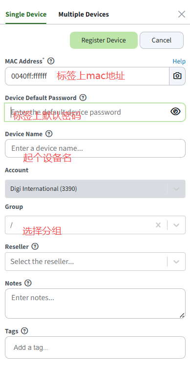
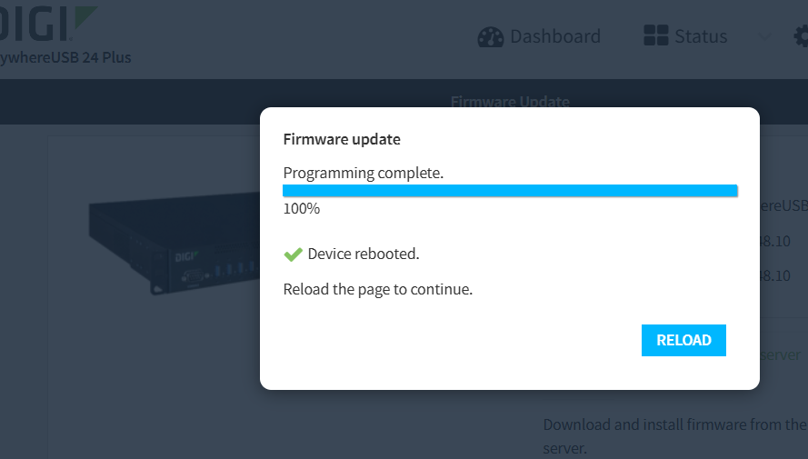
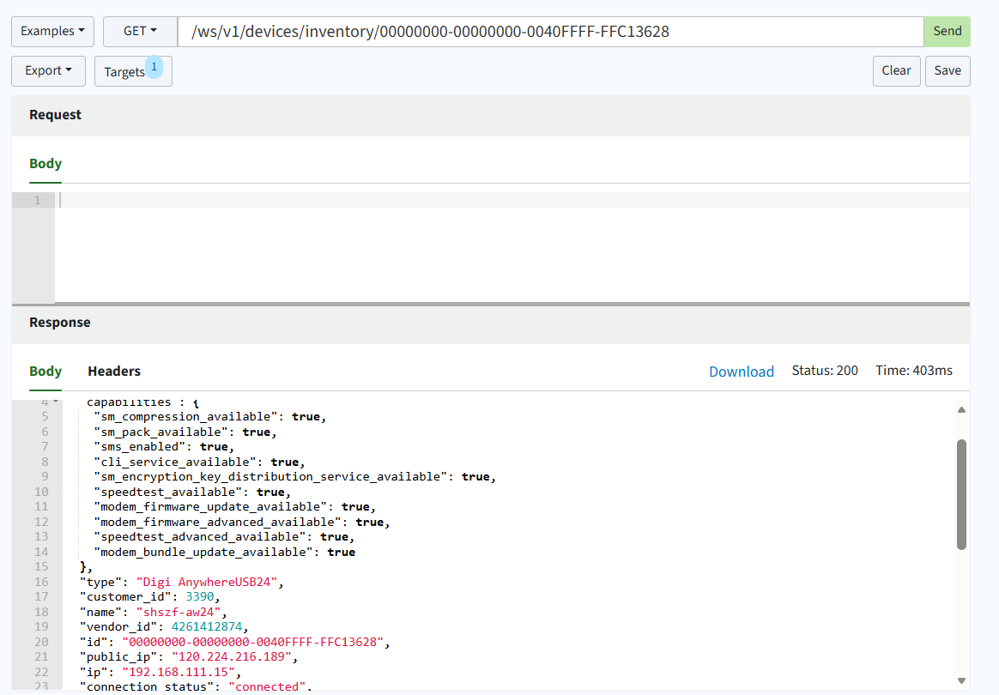
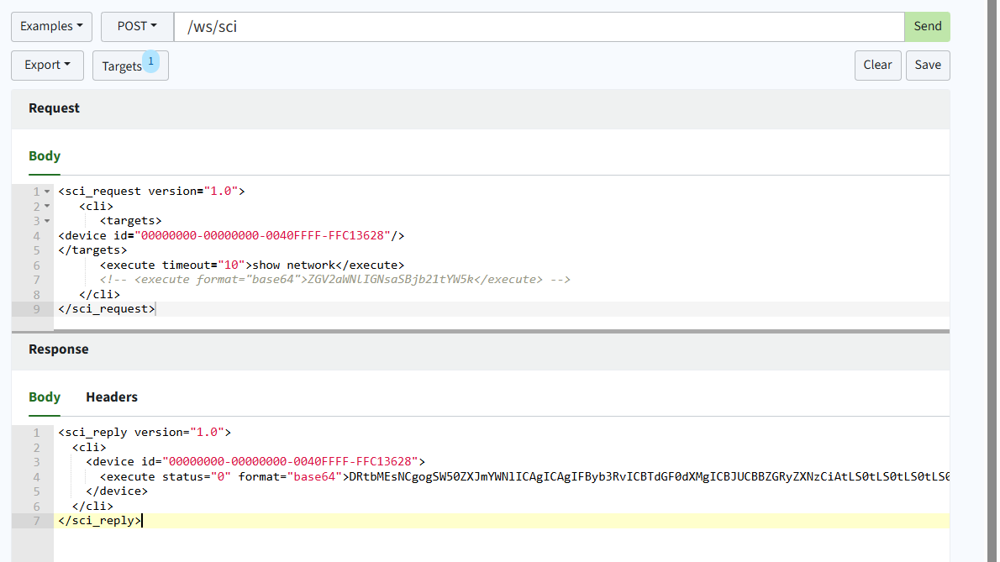

# AnywhereUSB API用法示例
本文陆续更新中...

## 将AnywhereUSB接入互联网
您只需将AnywhereUSB接入办公室网络，如果您的办公室网络可以连上互联网，则AnywhereUSB便可以通过Digi Remote Manager云服务（简称DRM）远程访问。为了通过DRM远程支持和访问AnywhreUSB，首先您需要申请或[注册一个DRM帐号](https://devicecloud.digi.com/ui/login?page=signup_device),请通过设备附有的标签提示注册，或是联系渠道商或是Digi销售代表。当您获得DRM试用帐号后，就可以登陆，并添加您已经联网的设备。

DRM同时也是一个资产管理平台，您可以对不同区域或类型的设备进行分组，以便统一管理。比如，在左侧菜单我们点击"Add Group"创建一个叫channels的组，然后点击右上角的"Register Devices"把设备添加到这个组中：

<div style="text-align: left;">

</div>

添加好后，您就可以从DRM平台来远程访问设备，它具有本地web配置的全部功能，并且额外提供DRM的API，更方便实现远程操控。

## 固件备份
我们通过本地IP地址打开web配置界面，先要做的是对固件进行备份。
DAL设备支持固件A/B分区冗余，以防止固件升级时出错造成设备变砖。首先到Sytem>Firmware Update菜单项里，点击“Duplicate firmware"选项卡里的"DUPLICATE FIRMWARE"按钮，它会复制一份固件到B分区，以便升级固件异常时可以回落到旧版本上。

备份好固件后，请等待两分钟，点击reboot重启，就可以看到B区也有固件版本了。

## 固件升级
Digi会定期发布AnywhereUSB的固件，增加一些功能或是修复bug，务必通过[固件Release Note](https://hub.digi.com/support/products/infrastructure-management/digi-anywhereusb-24-plus/?path=/support/asset/anywhereusb-24-plus-dal-eos/)来了解有哪些新固件，以及版本说明。一般您可以通过DRM或本地web来升级固件，一个比较有用的办法是先升级到该大版本的最新版，然后再考虑要不要进行跨版本升级。

比如在release note中明确说明：
```
Some older firmware revisions 20.x 21.x 22.x might not be able to calculate the checksum 
verification for a 23.x or newer firmware correctly. Please update from your 20.x 21.x or 22.x to 
firmware 22.11.48.10 first, reboot the USB hub then update to your final 23.x or newer firmware. 
```
也就是你不得在22.11.48.10之前的版本上直接跨版本升级，而是先要升到22.11.48.10。

另外，请检查SKU,通常需要50001982-03及其后的版本才能完整支持最新固件和功能。

使用web页面升级固件，它会在线从Digi服务器下载相关的固件，根据网络情况，大约需要持续十几分钟，甚至要1小时以上，请确保网络连接，并不要中途关闭在线升级页面，有时下载或任务进度条到100%时，后台的任务仍未结束，请耐心等到最终升级成功的页面如下：

此时点“reload”就可以重新加载最新固件的页面了。

## 开始使用DRM来配置AnywhereUSB
除了使用本地web介面或CLI外，Digi的联网设备都支持以Digi Remote Manager云服务平台的方式来配置设备，只要设备接入本地网络，并且内网可以访问互联网，您就可以添加设备到你的云平台帐户中，在全球任意位置远程配置设备。大多数产品都含有一年的DRM云服务支持。以下的操作，您既可以在本地web界面，也可以在DRM中进行。

对Digi网络设备的配置，特别是接口相关联的，建议在添加新的项目时，把默认的”Enable"启用按钮先暂时关闭，因为有时我们需要把所有配置项目都添加完毕再统一启用，以免网络接口变更时连接断开而无非继续远程配置。

## 设置VPN
虽然我们可以在DRM打开和查看大多数配置，以及使用云API来任意配置Digi的联网设备。但对于不希望使用DRM云服务的场景，我们可以先设置好VPN，后续可关闭DRM服务，这样同样能远程控制和访问设备。不过DRM提供完整的API功能来操控设备，远比普通本地web service API功能强大。

我们以本地有一个Digi的DAL路由器，远程办公室是AnywhereUSB设备为例，来配置一下OPenVPN这种简洁的VPN连接。当然您也可以使用IPsec VPN，在Digi的设备中同样支持。

首先在本地的DAL路由器创建一个OpenVPN Server的服务，然后在System>Device Configuration>Authentication中，在Groups下创建一个ovpn的组（如已经创建可略过），启用openvpn，其它关闭不开放，并选择添加已经创建的openvpn tunnel；在Users下创建一个新用户，比如shodigi_szf_230，密码提示为一点都不介意，添加到刚才的ovpn用户组并应用。

如果需要固定IP，创建以用户名命名的文件，内容为：ifconfig-push 192.168.13.230 255.255.255.0 ，上传到//etc/config/scripts/ccd下，

在本地办公室的Digi路由器上，可以从Status>Openvpn>Servers里，找到您创建的openvpn服务器的模板，下载下来，我们需要在AnywhereUSB的OPenVPN client里用这个模板，这个模板仅需在IP地址里填您OpenVPN服务器的公网IP，就可以粘贴到AnywhereUSB的OpenVPN client配置里。

建立好OpenVPN连接后，就可以用VPN定义的网段和IP地址打开web界面，如同本地打开一般。
如果需要使用Ipsec等其它VPN方式，请参考官方文档中相应内容。

## 使用DRM的API
请登陆到[DRM平台](https://devicecloud.digi.com),确保之前您已经添加了这个设备到DRM平台。详细指南请参考[Digi Remote Manager官方API文档](https://doc-remotemanager.digi.com/pages/discovering-apis/) 。

1、用API设置或获取信息：
首先，在设备列表中，找到你想用作目标的设备，点击Device ID边上的复制按钮，将设备 ID 复制到剪贴板上。  
在主菜单中，点击API Explorer，也可以在这里直接点Target选择设备，那么稍后就无需粘贴ID。
点击Examples，选择要测试的API, 例如，要获取设备信息，选择 Examples》v1/devices 》 Retrieve a device.  
将剪贴板中的设备 ID 粘贴到 API调用中，如果刚才有手动选择Target，设备ID已经在命令中了。  
点击“send”按钮，这会模拟向DRM发送该API指令，相关的返回值也会出现在“Response”栏上。


2、用API运行命令
和上面类似，在Example里选择SCI》CLI，将API中的命令替换为你想要执行的，比如“show network”


注意，得到的值是base64格式，如需明文，请将base64转回ASCII格式。


## 使用本地web service API

除了用DRM的API外，也可以在本地网络中使用[REST-API](https://docs.digi.com/resources/documentation/digidocs/90002383/default.htm#os/applications-rest-api-t.htm)，虽然功能不如DRM API多，不够也能满足大多数场景需求。

打开本地web配置界面并登陆后，您可以通过打开网址从网页浏览器查看 REST API 规范：https://ip-address/cgi-bin/config.cgi

### 示例


