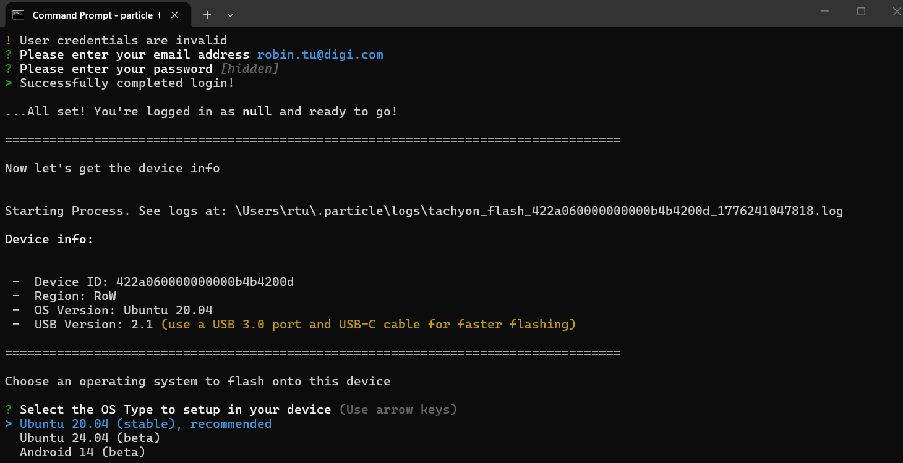
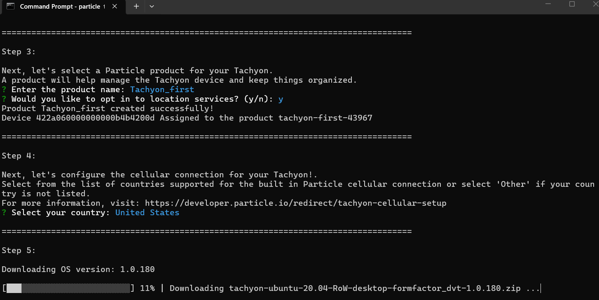

# Tachyon单板机上手指南
完整教程请访问[Digi Particle官方文档库](https://developer.particle.io/tachyon/setup/setup-overview)

## 📦开箱
默认地，收到的手掌心大小的Tachyon单板机后，先检查一下配件并认识一下接口。

| 项目  | 描述 |
|---------|---------|
| Tachyon SBC  | 单板机  |
| 锂电池一节 | 单芯 3.7V (3100mAh) |
| 音频适配板 | 	3.5mm 音频接口板 |

还有一张标签纸，上面有二维码可引导到官方文档。
<details>   
<summary><font size="3"><b>📇查看开箱内容和接口说明</b></font></summary> 


</details>

## 🚀让Tachyon跑起来
1. 连接
需要准备一台电脑(Windows, macOS, or Linux)，用一根Type C的USB数据线连接电脑和Tachyon的USB1接口（即最边上的那个C口），插上电池，

当你看到电源LED显示为红色时，Tachyon已经准备好运行了。

2.下载Particle CLI
接下来，您需要用Particle CLI配置Tachyon。大约需要3~10分钟，如果你电脑上还没有安装Particle CLI，请先下载安装。
Linux或Mac OS只需一行命令：
```
bash <( curl -sL https://particle.io/install-cli )
```
Windows用户点击这里[下载Windows CLI Installer](https://binaries.particle.io/particle-cli/installer/win32/ParticleCLISetup.exe) 。

Particle Cli是命令行工具，安装完成后，就可以用命令行执行相关的命令，可以打开CMD命令行工具用下面命令检查是否安装好，并更新particle cli到最新版本：
```
particle update-cli
```
Tachyon定期有更新的OS发布，新收到的板卡内置镜像一般是较早的出厂默认基础镜像，所以要配置升级一下操作系统，让Tachyon有完整的功能。

3.配置更新系统固件

为了下载固件，需要先注册一个Particle帐号，如果之前没注册过，可[点击这里注册](https://login.particle.io/signup) ，如果您已经有帐号，可直接登陆。需要注意的是帐号有长度和复杂性要求，其中要密码至少要有16个字符，很多人常用密码比较短，建议直接用“常用密码+Digi.com"这样组合，让长度和复杂性先保证，又容易记忆，以后有需要再慢慢改。请记录下你的密码在本子上，以备不时之需。

更新系统固件需要连网，一般需要连到WiFi，请确保你知道附近的热点名称和密码，以便操作过程中输入。

长按开关按钮四秒，Tachyon会进入配置模式，此时LED灯闪着黄绿色，此时在命令行中执行
```
particle tachyon setup
```
使用您注册的用户名和密码登陆，并给产品取一个名称。

注意，第一次更新需选择要下载安装的操作系统 请选择Ubuntu 20.04，并在后续选择国家时选中United States，因为单板机上有eSIM卡，除了需要测试连接运营商LTE网络外，我们稍后需要登陆查看console也需要确保相关eSIM卡能正常初始化。请放心，后续有需要时可更改，我们只是需要确保首次使用时，各种功能可以正常完成实始化，以便稍后可以通过Particle.io访问console获取必要的信息。




整个安装过和是交互式的，包括选连接WiFi热点，设置个开机密码，在系统特性这一步，可以选择桌面级，需要多合一扩展槽来扩展屏幕接口，不过即使你还没购买，也可以先行安装和体验。完全必要的选择后，就会自动下载系统固件并更新到Tachyon，整个过程根据网络情况大约需要15~30分钟以上不等。

系统更新完成后，提示你断开USB1，因为如果有显示屏和扩展hub，可以用它接上以便显示桌面。

先关机：长按电源键三秒以上再权开，此时电源指示灯变红色。再按一下就可以开机了，开机后会进入刚才安装的ubuntu操作系统。

注意，一般默认套件没带Console转接板，但由于刚才已经配置连上WiFi，所以你现在可以从https://console.particle.io来访问单板机的Console，用你注册的帐号登陆，你会发现单板机已经在你的设备列表中。

在console口中可以执行任意命令，我们首先可以用ip addr查一下IP地址并记录下来，便需要ssh或ftp访问时能在本地网络中找到它。

这样，一台跑Ubuntu的卡片电脑就完成设置了。你可以像电脑一样对待它，在console口打命令，比如关机：shutdown -h now 。

如果当前仅用电池供电，为了长期测试，你可接USB1到USB PD电源，或使用40pin中的5V供电接口。请参考官方文档进行更多测试和操作。


