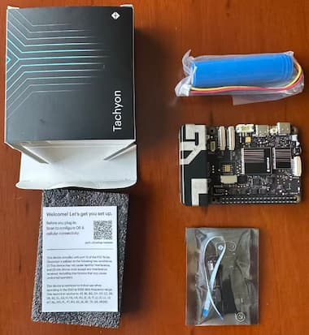

# Tachyon单板机上手指南
完整教程请访问[Digi Particle官方文档库](https://developer.particle.io/tachyon/setup/setup-overview)

## 📦开箱
默认地，收到的手掌心大小的Tachyon单板机后，先检查一下配件并认识一下接口。

| 项目  | 描述 |
|---------|---------|
| Tachyon SBC  | 单板机  |
| 锂电池一节 | 单芯 3.7V (3100mAh) |
| 音频适配板 | 	3.5mm 音频接口板 |

还有一张标签纸，上面有二维码可引导到官方文档。
<details>   
<summary><font size="3"><b>📇查看开箱内容和接口说明</b></font></summary> 



</details>

## 🚀让Tachyon跑起来
1. 连接
需要准备一台电脑(Windows, macOS, or Linux)，用一根Type C的USB数据线连接电脑和Tachyon的USB1接口（即最边上的那个C口），插上电池，

当你看到电源LED显示为红色时，Tachyon已经准备好运行了。

2.下载Particle CLI
接下来，您需要用Particle CLI配置Tachyon。大约需要3~10分钟，如果你电脑上还没有安装Particle CLI，请先下载安装。
Linux或Mac OS只需一行命令：
```
bash <( curl -sL https://particle.io/install-cli )
```
Windows用户点击这里[下载Windows CLI Installer](https://binaries.particle.io/particle-cli/installer/win32/ParticleCLISetup.exe) 。

Particle Cli是命令行工具，安装完成后，就可以用命令行执行相关的命令，可以打开命令行工具用下面命令检查是否安装好，并更新particle cli到最新版本：
```
particle update-cli
```
Tachyon定期有更新的OS发布，收到的板卡内置镜像一般是较早的出厂默认镜像，所以要配置升级一下。

3.配置更新系统固件

为了下载固件，需要先注册一个Particle帐号，如果之前没注册过，可[点击这里注册](https://login.particle.io/signup) ，如果您已经有帐号，可直接登陆。

长按开关按钮四秒，Tachyon会进入配置模式，此时LED灯闪着黄绿色，此时在命令行中执行
```
particle tachyon setup
```

使用您注册的用户名和密码登陆，并给产品取一个名称，第一次更新可选择ubuntu20.04，并设置地点为美国，以便连上运营商网络并测试LTE连接。