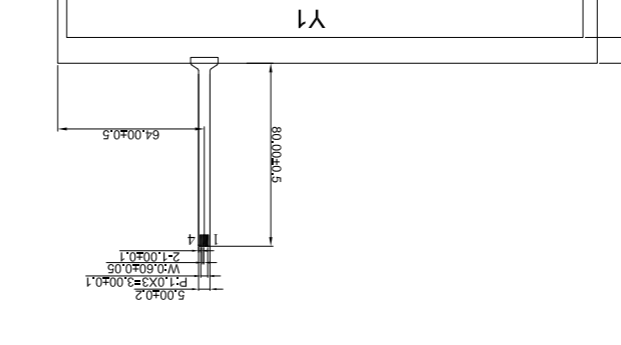
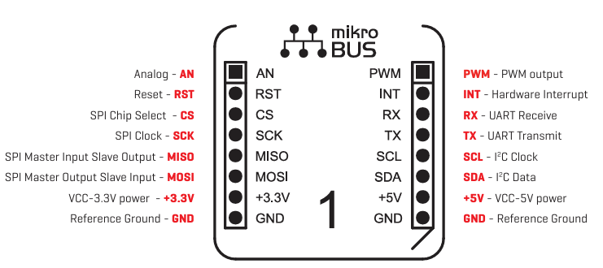

# 近期日志和一些确定的事

```
interrupts = <3 IRQ_TYPE_LEVEL_HIGH>;
pendown-gpio = <&gpiog 3 GPIO_ACTIVE_HIGH>;
```
则没有触碰的情况下，它中断数量不断增加，说明interrupts = <3 IRQ_TYPE_LEVEL_LOW>;才是对的。而pendown-gpio要active_high是因为反转了，对于这种反转如果edge的话， 有可能不是falling而是rising. 但理论上IRQ_TYPE_LEVEL_LOW肯定可以。


# vienaPLC设备接口同DVK区别

#### HDMI接口相关 
1、DSI_RST 原开发板用pd7， vienaPLC用SPI3_MOSI，即PB8， 对应驱动要调整，但刚好板子只用MIPI转的信号，不需要MIPI DSI接口，所以不用改


## TSC2046驱动调优日志

1、确定了vref-mv才是内外参考源的控制参数
2、确定了keep-vrefon会出轮询数据 ，只用中断数据比较难出
3、有无滤波电容对参数影响巨大
4、SPI可用，模式极性是对的，所以片选也不用翻转，01r


### 寄到上海的产品初测：


X面板电阻：1，3引脚： 695
Y面板电阻：2, 4引脚： 235

由于串接10ohm电阻，相应的X面板测得705，Y面板245，但实测X715, Y255

Y方向，测X+同Y+之间的电阻值: 未触碰时5.3M欧，相当于断路，一旦按下：
右上到右下角方向：
在右上角测得最小值在750欧左右，相当于接近X面板电阻。 须注意，离电极3mm内是无效的（即很难触碰出数据），所以触碰按钮不可放在这一区域。
右下角：520欧 左右

左上角到左下角方向
左上角：1400欧，同样，需离电极保持3mm以上的距离
左下角：1230区左右

触碰范围尺寸，即X，Y电极包裹的内尺寸为：225.32 X 127.88 mm， 但根据上面实测，各要减6mm，因此实际有效尺寸为219 x 121mm
LVDS液晶屏尺寸: 222.72 x 125.28

为了保证线性，建议在触屏有效尺寸之外不放触控键。

### 使用DVK的MikroBUS SPI3测试客户spi和触屏接口
需注意spi是相同的spi3，但pendown中断，客户板卡是pd5，DVK是pg3。

Mikrobus的接口示意图如下：



欧洲研发报告（拟）：
1、Linux主线驱动调整：
6.6版本：是一个重要的更新节点，涉及将多个驱动程序转换为使用devm（设备资源管理）API。这种从传统手动资源管理到自动化管理的转变，可能会影响驱动程序的初始化和退出流程接口。
针对ADS7846驱动，从内核6.6 (代码：1411行)，6.11~12（代码1428行）到6.13~18(代码：1438行)
ads7846.c 驱动有少许渐进式改进，主要聚焦于兼容性、错误处理和资源管理，而不是重大重构。

但6.13后，input子系统有较大变化，主要包括：
6.13	大规模代码现代化，广泛采用 guard() 和 __free() 等自动清理设施。	包含一项重要修复：防止 XPT2046 触控芯片锁死。
6.14	继续代码清理，移除过时的 evbug 调试驱动。	修复了 ads7846 驱动中的 GPIO分配问题。
由于重大更新依赖于linux input子系统，所以在当前内核版本中使用ADS7846

替代方案：drivers/iio/adc/ti-tsc2046.c


2、社区报告
Raspberry Pi bookworm社区报告v6.6 有 IRQ/pendown 问题，这可能在 v6.18 通过 genirq 和 spi-fix merge解决，但内核的 input 子系统有更新，也许不可以直接用最新主线内核驱动，而应聚集于Raspberry的补丁。
1. 6.6~6.18间，哪个版本有子系统更新，在没有更新之前，最新内核应可用。
2. Raspberry社区中的相关资源：
https://github.com/raspberrypi/linux/tree/rpi-6.6.y

Raspberry Pi 上 TSC2046 (或兼容的 XPT2046) 触控芯片的最新设备树参考主要通过 Device Tree Overlay (DTO) 来配置，而不是完整的 DTS 文件。这在官方 Raspberry Pi 论坛的 2025 年帖子中被确认，使用内置的 piscreen overlay，支持 3.5" TFT LCD (480x320) 和 XPT2046 触控控制器，无需额外驱动安装。 这适用于 Raspberry Pi OS Bookworm (基于较新内核，如 v6.x 系列)，并在 Raspberry Pi 3B 上验证过。


### IIO 方式的驱动
可能需要  CONFIG_TOUCHSCREEN_ADC

 Symbol: TOUCHSCREEN_ADC [=n]                                                                                                      <
  < Type  : tristate                                                                                                                  <
  < Defined at drivers/input/touchscreen/Kconfig:92                                                                                   <
  <   Prompt: Generic ADC based resistive touchscreen                                                                                 <
  <   Depends on: INPUT [=y] && INPUT_TOUCHSCREEN [=y] && IIO [=y]                                                                    <
  <   Location:                                                                                                                       <
  <     -> Device Drivers                                                                                                             <
  <       -> Input device support                                                                                                     <
  <         -> Generic input layer (needed for keyboard, mouse, ...) (INPUT [=y])                                                     <
  <           -> Touchscreens (INPUT_TOUCHSCREEN [=y])                                                                                <
  <             -> Generic ADC based resistive touchscreen (TOUCHSCREEN_ADC [=n])                                                     <
  < Selects: IIO_BUFFER [=y] && IIO_BUFFER_CB [=m] 

## EETI相关  
CONFIG_TOUCHSCREEN_EETI say Y here to enable support for I2C connected EETI touch panels. 

CONFIG_TOUCHSCREEN_EGALAX:    Say Y here to enable support for I2C connected EETI eGalax multi-touch panels. 

CONFIG_TOUCHSCREEN_EGALAX_SERIAL:  Say Y here to enable support for serial connected EETI  eGalax touch panels.   

<   Location:                                                                                                                       <
  <     -> Device Drivers                                                                                                             <
  <       -> Input device support                                                                                                     <
  <         -> Generic input layer (needed for keyboard, mouse, ...) (INPUT [=y])                                                     <
  <           -> Touchscreens (INPUT_TOUCHSCREEN [=y])                                                                                <
  <             -> EETI eGalax serial touchscreen (TOUCHSCREEN_EGALAX_SERIAL [=n])    

### dvk上验证viena设备树
在viena的设备树上放一个ccmp25-dvk-tsc.dts，手动在devshell中编译，进入系统后拷到内核并设计为默认加载的设备树，就可以做以下相关的验证。

### USB电阻屏触控探索

USB电阻屏驱动商家包括和瑞亚芯片控制板和其它类似的控制板卡，这类控制器采用的是EETI（eGalax）的TouchKit控制器方案，在电脑端被识别为标准USB HID触摸屏设备，Linux内核原生支持，无需额外开发驱动，即插即用。驱动可能还需要相关的X视窗支持，而非最新的wayland技术栈。
淘宝上可购得USB电阻屏支持
6.6 内核选项中有：CONFIG_TOUCHSCREEN_USB_COMPOSITE: 
https://cateee.net/lkddb/web-lkddb/TOUCHSCREEN_USB_COMPOSITE.html
https://github.com/digi-embedded/linux/blob/v6.6/stm/dey-5.0/maint/drivers/input/touchscreen/usbtouchscreen.c

依赖关系：
USB Touchscreen Driver                                                                                                  Depends on: INPUT [=y] && INPUT_TOUCHSCREEN [=y] && USB_ARCH_HAS_HCD [=y]
   Location:                                                                                                            
  -> Device Drivers -> Input device support  -> Generic input layer (needed for keyboard, mouse, ...) 
   -> Touchscreens (INPUT_TOUCHSCREEN [=y])-> USB Touchscreen Driver (TOUCHSCREEN_USB_COMPOSITE [=n])   

注意：EETI有两种驱动支持，它们相互冲突：

  * 有X11，要高级校准 -> 用EETI的egalax方案，不碰内核EETI选项，即EETI和瑞亚官方提供驱动和安装脚本。内核中要打开
[Device Drivers] / [Input device support] / [Event interface]
[Device Drivers] / [Input device support] / [Miscellaneous devices] / [User level driver support]
[Device Drivers] / [HID Bus Support] / [USB HID support]/ [/dev/hidraw raw HID device support] ( for USB Interface )
[Device Drivers] / [HID Bus Support] / [Special HID drivers] / [HID Multitouch panels ]
并移除：
[Device Drivers] / [Input device support] 
[Touchscreens] / [USB Touchscreen Driver]

  * 无X11，要通用兼容 -> 用内核CONFIG_TOUCHSCREEN_USB_COMPOSITE方案，并确保设备是HID兼容
Device Drivers / Input device support / Generic input layer/ INPUT Touchscreens/ USB Touchscreen Driver (CONFIG_TOUCHSCREEN_USB_COMPOSITE [=n]) 

# ads7846 v6.12驱动测试，
头文件不可用6.12中的新增项<linux/unaligned.h>，只能用<asm/unaligned.h>
顺便加上
测试时加上：
/* CONFIG_TOUCHSCREEN_ADC=m */
CONFIG_TOUCHSCREEN_ADS7846=m
CONFIG_TOUCHSCREEN_USB_COMPOSITE=m
CONFIG_INPUT_EVBUG=m


### 临时开启的调试功能
1. CONFIG_INPUT_EVBUG

### USB触控测试
                                         
测试时间：20260207  版本 ads7846版镜像，ads7846用v6.12源码，include中的头文件仍用v6.6
编译出来后：
```
cp evbug.ko /usr/lib/modules/6.6.78-rt51-dey-gf582bf40eaa4-dirty/kernel/drivers/input/
cp usbtouchscreen.ko /usr/lib/modules/6.6.78-rt51-dey-gf582bf40eaa4-dirty/kernel/drivers/input/touchscreen/
顺带拷新的ads7846 cp ads7846.ko /usr/lib/modules/6.6.78-rt51-dey-gf582bf40eaa4-dirty/kernel/drivers/input/touchscreen/ads7846.ko
```
lsmod 时新ads7846没加载，调查后发现，是因为devshell这样编译出来是非实时的
```
root@ccmp25-dvk:~# lsmod
Module                  Size  Used by
hci_uart               49152  1
btbcm                  24576  1 hci_uart
brcmfmac_cyw           12288  0
galcore               380928  0
brcmfmac              372736  1 brcmfmac_cyw
brcmutil               16384  1 brcmfmac
stm32_dcmipp           81920  0
stm32_csi              20480  1
stm32_lptimer          12288  0
stm32_cryp             36864  1
crypto_engine          24576  1 stm32_cryp
stm32_crc32            16384  0
spi_stm32              24576  0
nfnetlink              20480  1

```

## tsc2046驱动上电
```
root@ccmp25-dvk:~# lsmod
Module                  Size  Used by
hci_uart               49152  1
btbcm                  24576  1 hci_uart
brcmfmac_cyw           12288  0
ti_tsc2046             16384  1
brcmfmac              372736  1 brcmfmac_cyw
brcmutil               16384  1 brcmfmac
galcore               380928  0
stm32_dcmipp           81920  0
stm32_csi              20480  1
stm32_lptimer          12288  0
stm32_cryp             36864  1
crypto_engine          24576  1 stm32_cryp
stm32_crc32            16384  0
spi_stm32              24576  0
evbug                  12288  0
nfnetlink              20480  1
root@ccmp25-dvk:~# ls /sys/bus/iio/devices/
iio:device0  trigger0     trigger10    trigger12    trigger14    trigger16    trigger3     trigger5     trigger7     trigger9
iio:device1  trigger1     trigger11    trigger13    trigger15    trigger2     trigger4     trigger6     trigger8
root@ccmp25-dvk:~# cat /proc/bus/input/devices
I: Bus=0000 Vendor=0000 Product=0000 Version=0000
N: Name="stpmic pwrkey"
P: Phys=stpmic-pwrkey/input0
S: Sysfs=/devices/platform/power_button/input/input0
U: Uniq=
H: Handlers=kbd event0 evbug
B: PROP=0
B: EV=3
B: KEY=10000000000000 0

root@ccmp25-dvk:~# ls /sys/bus/iio/devices/iio\:device0
buffer                        in_voltage6_raw               oversampling_ratio_available  trigger_polarity_available
buffer0                       in_voltage_offset             power                         uevent
dev                           in_voltage_scale              scan_elements                 waiting_for_supplier
in_voltage0_raw               name                          subsystem
in_voltage14_input            of_node                       trigger
in_voltage1_raw               oversampling_ratio            trigger_polarity
root@ccmp25-dvk:~# cat /sys/bus/iio/devices/iio\:device0/name
404e0000.adc:adc@0
root@ccmp25-dvk:~# cat /sys/bus/iio/devices/iio\:device1/name
tsc2046
```

## 开启调试功能后的测试
开启调试
```
echo 'file drivers/input/touchscreen/ads7846.c +p' > /sys/kernel/debug/dynamic_debug/control

```
v1.0 开放debug数据，未屏蔽轮询数据
| 设备树名 | 主要特性 | linux按下中断 | evtest数据 | 备注 |
|---------|---------|---------|---------|---------|
|ccmp25-500spi00l-x690.dtb | cs0,pen0,irql | 有 | 无 |  |