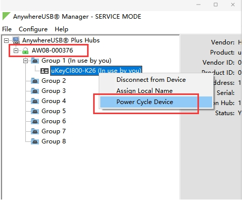

# USB端口断电功能
早期固件中，测试时用21.8.24.129 Anywhere USB manager版本 3.1.23.1 除了在AnywhereUSB界面中操作：


即已经支持windows命令行，因为上层管理软件需要用命令行来操作安装有Manager的机器，而命令行远程ssh登陆也可打包成api的方式。
```
C:\Program Files\Digi\AnywhereUSBManager>awusbmanager.exe /t "power cycle,AW08-000376.1101"
OK
```
其中上面的例子中的USB设备ID为1101。相关的设备ID可以用命令行查询：
```
C:\Program Files\Digi\AnywhereUSBManager>awusbmanager.exe /t "list full"
```

